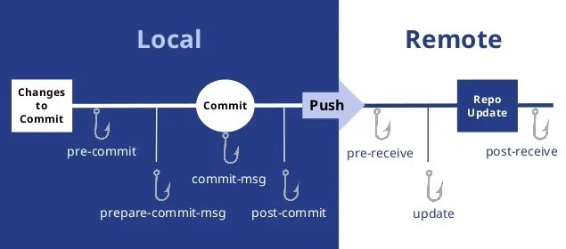

# Git Hooks

This is a page that will contain more information about Git Hooks.



## Local hooks

As already mentioned, the hooks can be modified by the contributor. Local hooks run on your local machine and only apply to the repository in which they are installed. These hooks enable you to maintain consistency and automate specific actions in your local repository.

Some of the most used local hooks are:
- `pre-commit`
- `prepare-commit-msg`
- `commit-msg`
- `post-commit`
- `post-checkout`
- `pre-rebase`


#### Pre-Commit
The `pre-commit` hook is naturally linked to `git commit` command. It is executed before you even type in a commit message. Serves to check the snapshot to be committed, to ensure your commits meet some (formal) requirements or do not break any existing functionality.
If the script in the `pre-commit` hook returns a non-zero exit code, the commit is aborted.

This example of a `pre-commit` hook prevents incorrect authors from committing and checks the signing key:

```bash
#!/bin/bash

PWD=`pwd`
globalEmail=`git config --global --get user.email`
signingKey=`git config --global --get user.signingkey`
workEmail="example@axosoft.com"

if [[ $PWD != "*demo*" && $globalEmail != $workEmail ]];
then
        echo "Commit email and global git config email differ"
        echo "Global commit email: "$globalEmail""
        echo "Committing email expected: $workEmail"
        exit 1
elif [[ $signingKey -eq "" ]];
then
        echo "No signing key found. Check global gitconfig"
        exit 1
else
        echo ""
        exit 0
fi
```

#### Prepare-Commit-Message
Runs between the dafault log message creation and editor poping up. It is used to populate the text editor with a automatic commit message.
You need to specify 1-3 parameters in `prepare-commit-msg`:
- The name of the file that contains the commit message
- The source of the commit message (message, template, merge, squash or commit)
- The hash of the relevant commit.

#### Commit-Message
The `commit-msg` hook is executed after the user enteres a commit message. Its main purpose is to ensure that your commit messages are in consistency with other developers. It can be used to enforce specific message formats or issue tracking conventions. Only one argument is passed to this hook, and that is the name of the file that contains the desired commit message.

If `prepare-commit-msg` and `commit-msg` hooks exit in a non-zero status, the commit is prevented.

#### Post-Commit
This hook is called after a commit has been successfully made. It takes no parameters, and is often used for notifications. Note that this hook cannot affect the outcome of a `git commit`, which means that even a non-zero exit status will not terminate it.

#### Post-Checkout
The `post-checkout` hook is called after a `git checkout` or `git switch` operation has been run. It takes three parameters:
- The ref of the previous HEAD
- The ref of the new HEAD
- A flag indicating whether the checkout was a branch checkout or a file checkout

#### Pre-Rebase
The `pre-rebase` hook is executed before the git rebase operation is completed. It is used to prevent or customize the rebase process, ensuring it complies with your project's guidelines. Two arguments are passed to the `pre-rebase` script:
- The upstream branch from which the series was forked
- The branch being rebased